# Technologies
* MVVM Architecture
* Data Binding
* Room
* Retrofit
* RxJava
* Koin
* Socket.io   

# API
https://github.com/SaharNajmi/DivarAPI

## Screenshots

  
  
  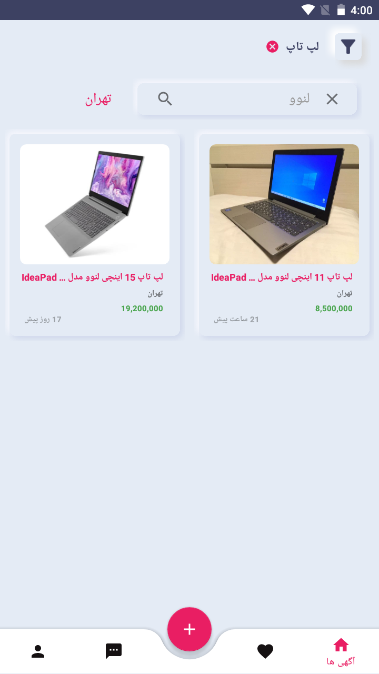

  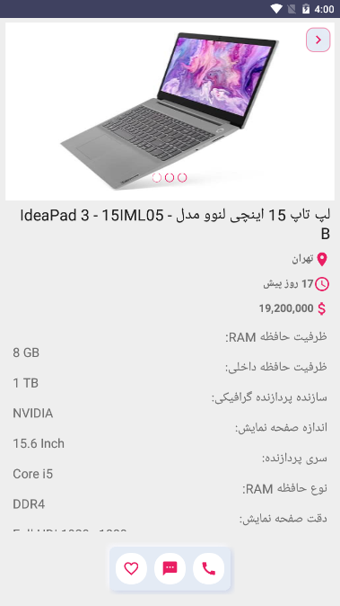
  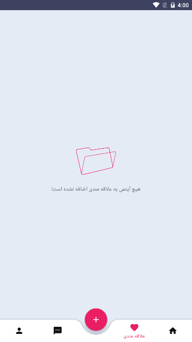
  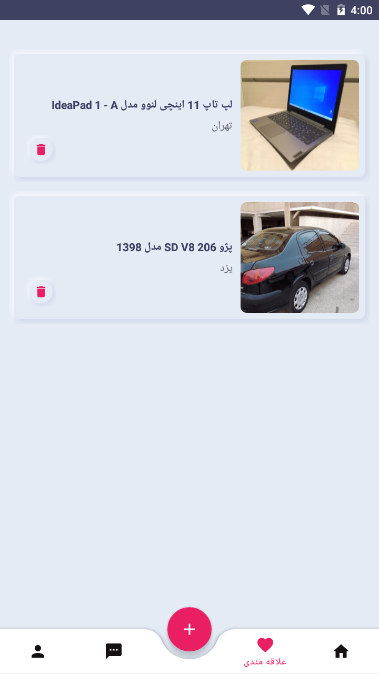

  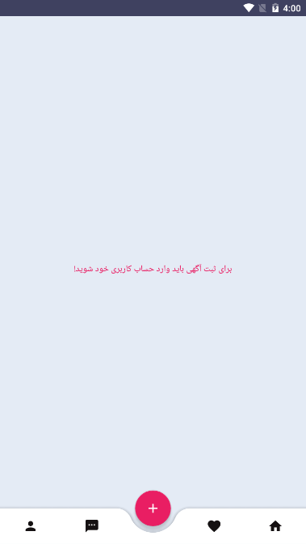
  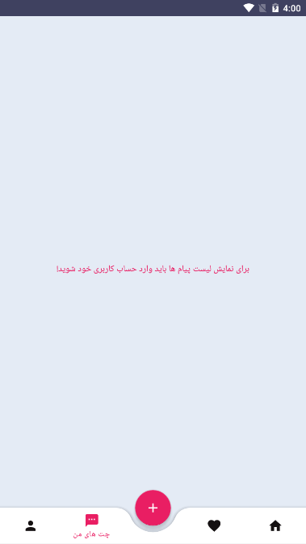
  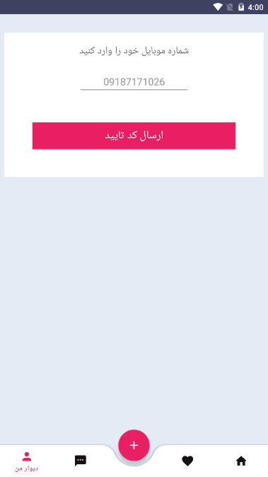

  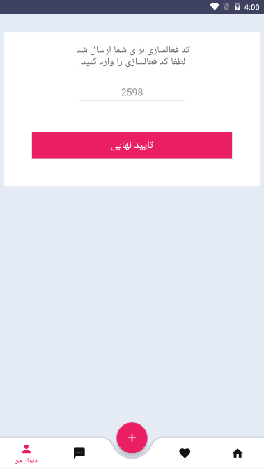
  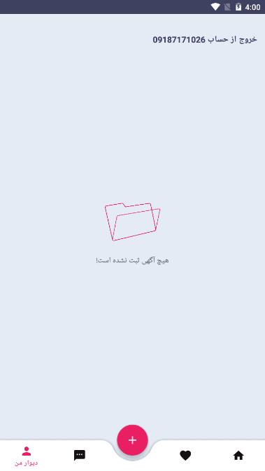
  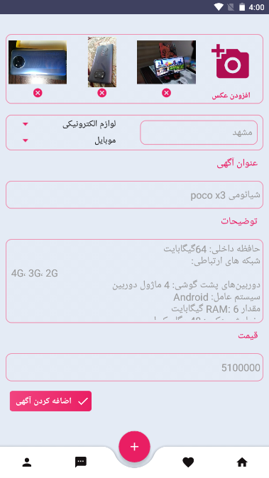

  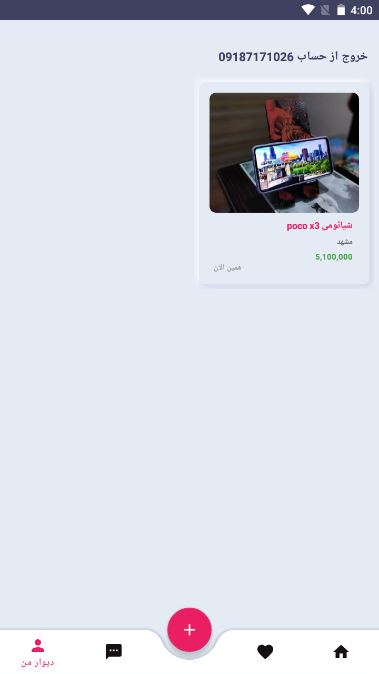
  
  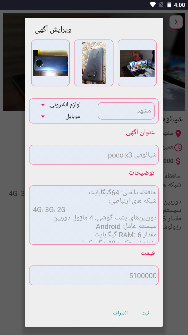

  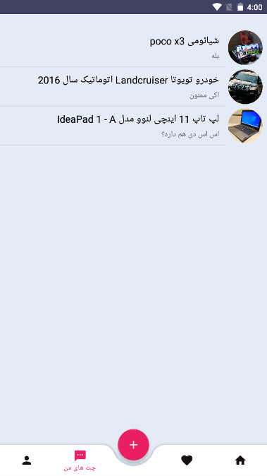
  
  

